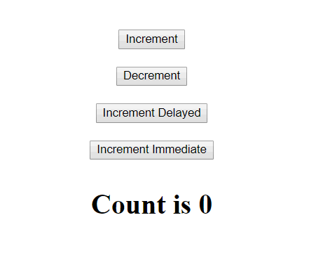

- title : Scaling Elmish Applications
- description : Introduction to the techniques of building largs elmish applications
- author : Zaid Ajaj
- theme : night
- transition : default

***

## Scaling Elmish Applications

 
 

### Introduction to the techniques of breaking down large elmish programs into smaller ones
 
 
Zaid Ajaj - [@zaid-ajaj](http://www.twitter.com/zaid-ajaj)

***

### Table of content

* Introduction
* Basics of Elmish 
* Concept of an "Elm program"
* Importance of commands
* Larger programs 
* Challenges of breaking down programs
   - Breaking down parent state  
       - Keeping state of a single child program
       - Keeping state of all children programs
   - Child programs (updates, dispatch and commands)
* Application concerns: Root level vs. deep children
* Ongoing developements: the good and the lacking
* Resources to learn more
* Word for consultants/trainers
  
***

### Introduction

- About me
- The talk

***

### Basics of Elmish

    type State = { Count: int }

    type Msg = Increment | Decrement

    let init() : State = { Count = 0 } 

    let update msg state = 
        match msg with 
        | Increment -> { state with Count = state.Count + 1 }
        | Decrement -> { state with Count = state.Count - 1 }

    let view state dispatch = 
        div [ ] [ 
            button [ OnClick (fun _ -> dispatch Increment) ]
                   [ str "Increment" ]  
            button [ OnClick (fun _ -> dispatch Decrement) ]
                   [ str "Decrement" ]
            h1 [ ] 
               [ str (sprintf "Count is at %d" state.Count) ] 
        ]

***

    type Message = 
        | Increment 
        | Decrement 
        | IncrementImmediate
        | IncrementDelayed 

    // update : Msg -> State -> State * Cmd<Msg>
    let update msg state  = 
        match msg with 
        | Increment -> 
            let nextState = { state with Count = state.Count + 1 }
            nextState, Cmd.none 

        | Decrement ->
            let nextState = { state with Count = state.Count - 1 }
            nextState, Cmd.none

        | IncrementImmediate ->
            let nextCmd = Cmd.ofMsg Increment 
            state, nextCmd

        | IncrementDelayed -> 
            let nextCmd = Cmd.afterTimeout 1000 Increment 
            state, nextCmd

***

***

***
    | LoadBlogInfo ->
        let nextState = { state with BlogInfo = Loading }
        nextState, Http.loadBlogInfo
        
    | BlogInfoLoaded (Ok blogInfo) ->
        let nextState = { state with BlogInfo = Body blogInfo }
        let setPageTitle title = 
            Fable.Import.Browser.document.title <- title 
        nextState, Cmd.attemptFunc setPageTitle blogInfo.BlogTitle (fun ex -> DoNothing)
        
    | BlogInfoLoaded (Error errorMsg) ->
        let nextState = { state with BlogInfo = LoadError errorMsg }
        nextState, Toastr.error (Toastr.message errorMsg)

    | BlogInfoLoadFailed msg ->
        let nextState = { state with BlogInfo = LoadError msg }
        nextState, Cmd.none
        
    | NavigateTo page ->
        let nextUrl = Urls.hashPrefix (pageHash page)
        state, Urls.newUrl nextUrl

    | DoNothing ->
        state, Cmd.none

***

### Model - View - Update

    // wiring things up

    Program.mkSimple init update view
    |> Program.withConsoleTrace
    |> Program.withReact "elmish-app"
    |> Program.run

---

### Model - View - Update

# Demo

***

### Sub-Components

    // MODEL

    type Model = {
        Counters : Counter.Model list
    }

    type Msg = 
    | Insert
    | Remove
    | Modify of int * Counter.Msg

    let init() : Model =
        { Counters = [] }

---

### Sub-Components

    // VIEW

    let view model dispatch =
        let counterDispatch i msg = dispatch (Modify (i, msg))

        let counters =
            model.Counters
            |> List.mapi (fun i c -> Counter.view c (counterDispatch i)) 
        
        div [] [ 
            yield button [ OnClick (fun _ -> dispatch Remove) ] [  str "Remove" ]
            yield button [ OnClick (fun _ -> dispatch Insert) ] [ str "Add" ] 
            yield! counters ]

---

### Sub-Components

    // UPDATE

    let update (msg:Msg) (model:Model) =
        match msg with
        | Insert ->
            { Counters = Counter.init() :: model.Counters }
        | Remove ->
            { Counters = 
                match model.Counters with
                | [] -> []
                | x :: rest -> rest }
        | Modify (id, counterMsg) ->
            { Counters =
                model.Counters
                |> List.mapi (fun i counterModel -> 
                    if i = id then
                        Counter.update counterMsg counterModel
                    else
                        counterModel) }

---

### Sub-Components

# Demo

***

### React

* Facebook library for UI 
* <code>state => view</code>
* Virtual DOM

---

### Virtual DOM - Initial

 
 

 

 
 

 <small>http://teropa.info/blog/2015/03/02/change-and-its-detection-in-javascript-frameworks.html</small>

---

### Virtual DOM - Change

 
 

 

 
 

 <small>http://teropa.info/blog/2015/03/02/change-and-its-detection-in-javascript-frameworks.html</small>

---

### Virtual DOM - Reuse

 
 

 

 
 

 <small>http://teropa.info/blog/2015/03/02/change-and-its-detection-in-javascript-frameworks.html</small>

*** 

### ReactNative

 

 <small>http://timbuckley.github.io/react-native-presentation</small>

***

### Show me the code

*** 

### TakeAways

* Learn all the FP you can!
* Simple modular design

*** 

### Thank you!

* https://github.com/fable-compiler/fable-elmish
* https://ionide.io
* https://facebook.github.io/react-native/
